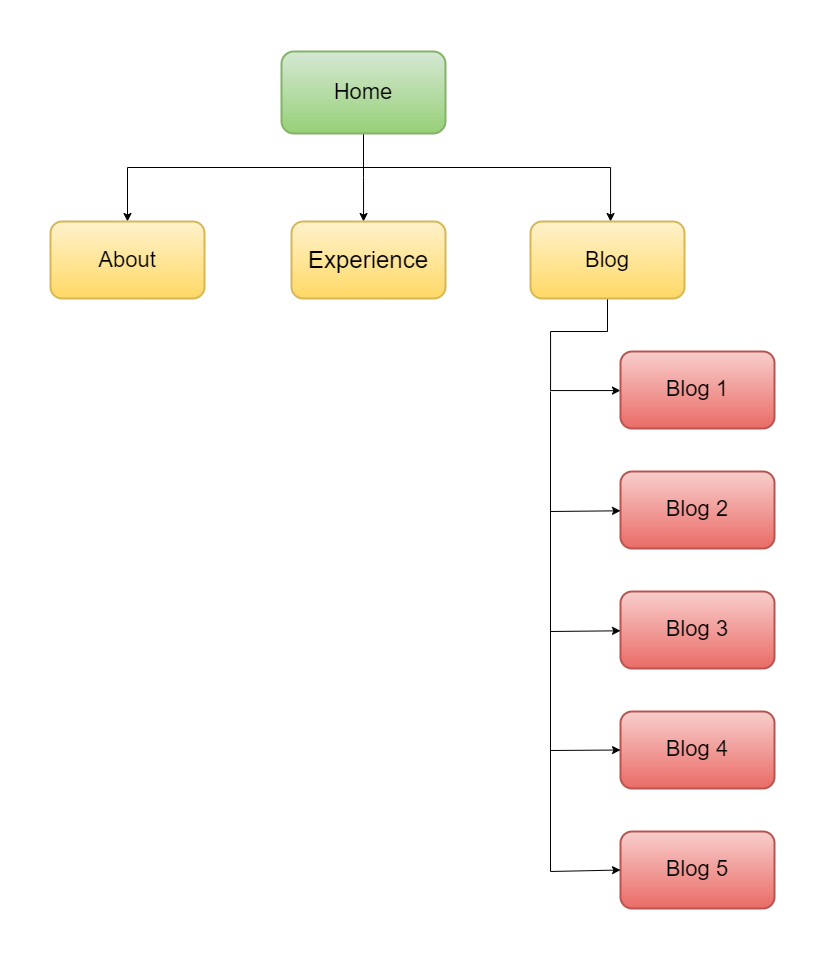
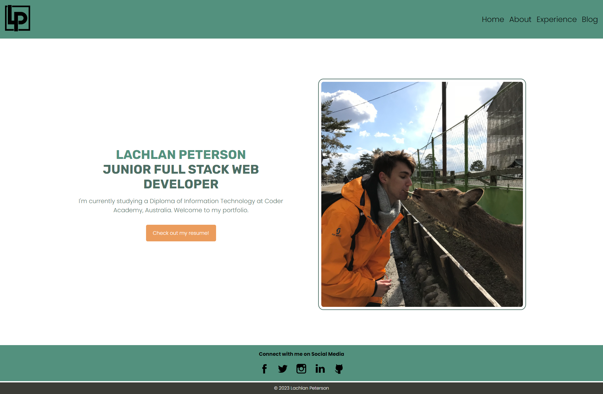
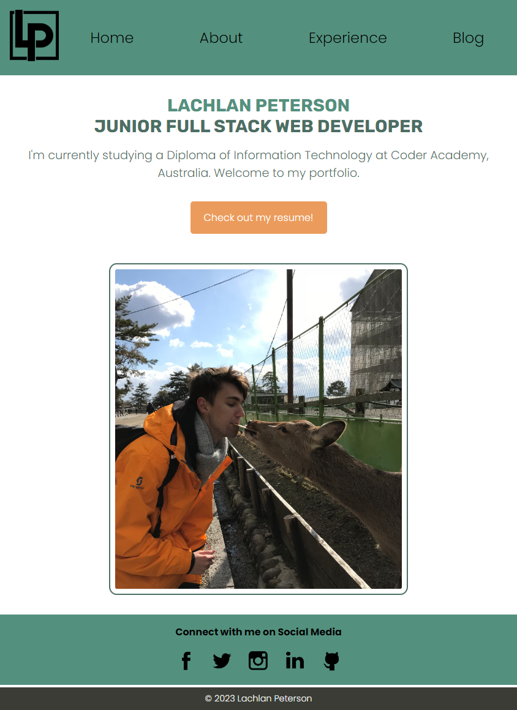
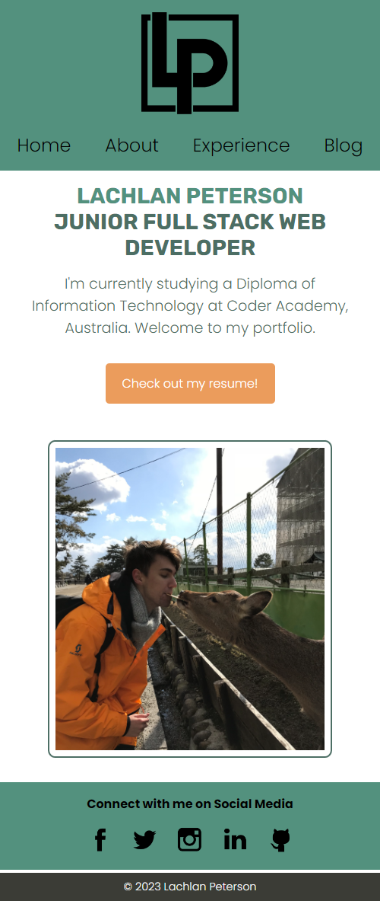
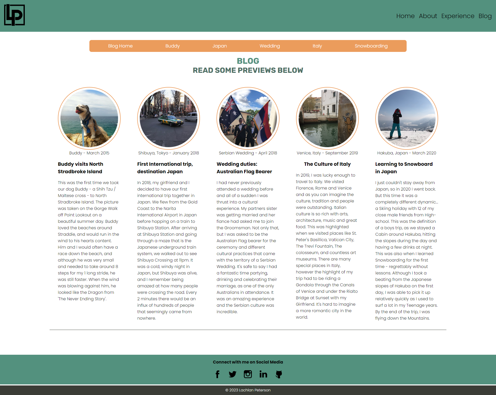

# LachlanPeterson_T1A2

The following project was created by **Lachlan Peterson** in order to fulfill the requirements of ***Coder Academy's*** Website Portfolio Assignment **(T1A2)**.

---

## Table of contents
1. [Published Portfolio](#portfolio-link)
2. [Github Repository](#github-repository)
3. [Presentation Video](#presentation-video)
4. [Description of Website Portfolio](#website-description)
    - [Purpose](#purpose)
    - [Functionality / Features](#functionality--features)
    - [Sitemap](#sitemap)
    - [Screenshots](#screenshots)
    - [Target Audience](#target-audience)
    - [Tech Stack](#tech-stack)

---

## Portfolio Link

The following link will take you to my Published Website Portfolio:

[*Lachlan Peterson's Website Portfolio*]()

---

## Github Repository
The following link will take you to the Github Repo for my Portfolio Assignment:

[*LachlanPeterson_T1A2 Github Repository*](https://github.com/LachlanPeterson/LachlanPeterson_T1A2)

---

## Presentation Video
The following link will take you to my Presenation Video for my Portfolio Assignment:

[*Lachlan Peterson's Portfolio Presentation*]()

---

## Website Description

My website is a simplistic, yet aesthetically pleasing portofolio that give users an insight into my:
- Personality, Hobbies and Interests,
- Background, Study and Work History,
- and current experience in Full Stack Web Development.

Because this portfolio is geared towards potential employers, the website also provides users with some of my essential information:
- Full name and contact details,
- Multiple links to a PDF File of my Current Resume (CV),
- Links to all my professional and social accounts (e.g. Github, LinkedIn, Twitter etc.)

I'm able to portray a large amount of information through cleverly thought out page designs and a navigation bar, which makes finding the correct content a breeze. The website contains 4 main pages Home, About Me, A Blog Directory and Experience with FSD. Through the use of effective layout, good design principles and the use of responsive css, this website can function on Mobile, Tablet and PC devices. 

[*Back to Top*](#lachlanpeterson_t1a2)

 

### Purpose:

The aim of this project was to create a portfolio website that presents myself as an aspiring *developer* and *IT professional* to prospective employers. 

We can then Update this Portfolio indefinitely, and especially through-out our time at Coder Academy, to serve as a bridge between our skillset and Professionals in the space. Ultimately, the purpose is to link our Portfolio on our Professional Social Media Accounts, Embed it in our Resume/CV and also provide it when applying for Job Opportunities. 

To achieve this, I have designed, developed and deployed a website that showcases my newly learned abilities and coding experience. This website provides users with enough information about me, my interests, professional knowledge and skillset to possibly result in the furthering of my career in the space. 

[*Back to Top*](#lachlanpeterson_t1a2)

 

### Functionality / Features:

[*Back to Top*](#lachlanpeterson_t1a2)

 

### Sitemap:

From the Home page you are able to access the About, Experience and Blog page through the Main Navigation Menu in the Header. The Blog page has its own navigation menu that sits within the main content that allows you to navigate between different blog posts. 

*Note: All of the pages have the Main Navigation Menu in the Header to allow for seamless transitions between web pages as previous mentioned in Functionality/Features.* 

Figure 1.

> This is the Sitemap of my Website Portfolio. It includes the **Main Navigation Bar** in ***Yellow***, and the **Blog Directory** in ***Red***.

[*Back to Top*](#lachlanpeterson_t1a2)

 

### Screenshots:

The following screenshots are inteded to show the overall aesthetics of the Portfolio, and to highlight the use of Responsive Design in the layout. I have not included screenshots of every page in this README file, as the [Presentation Video](#presentation-video) contains screenshots of all the web pages, in Mobile, Tablet and Desktop view.

The following Figures show the changing Layouts of the Home page, and the aesthetically pleasing design of Blog Directory page:

 

Figure 2.

> This is the Home Page of the Website in **Desktop** mode .

 

Figure 3.

> This is the Home Page of the Website in **Tablet** mode .

 

Figure 4.

> This is the Home Page of the Website in **Mobile** mode.

 

Figure 5.

> This is the Blog Directory page in **Desktop** mode .

[*Back to Top*](#lachlanpeterson_t1a2)

 

### Target Audience: 

To re-instate the aim of this project with a quote from the [Purpose](#purpose) section,
> "the aim was to create a portfolio website that presents myself to ...IT Professionals and Potential Employers... as a Full Stack Web Dev in the making."

Therefore, my goal is to create a portfolio that showcases my skills so I can send the link to Potential Employers, Professionals in the space, or even Hiring Managers. Because of this, the website's **Target Audience** is strongly intended to be IT Professionals, ideally in the FS Web Dev space, who are looking to engage a Dev for hiring purposes.

[*Back to Top*](#lachlanpeterson_t1a2)

 

### Tech stack:

[*Back to Top*](#lachlanpeterson_t1a2)
